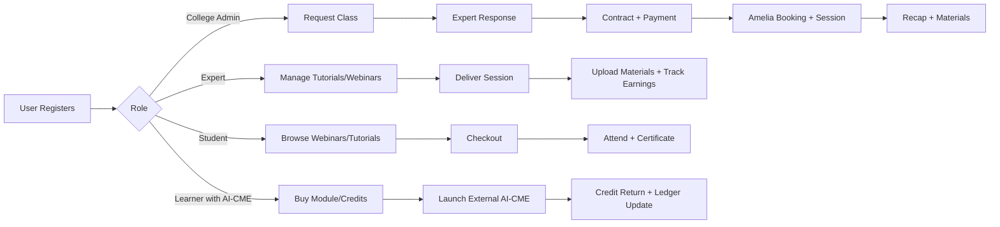
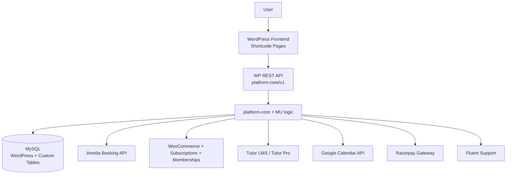
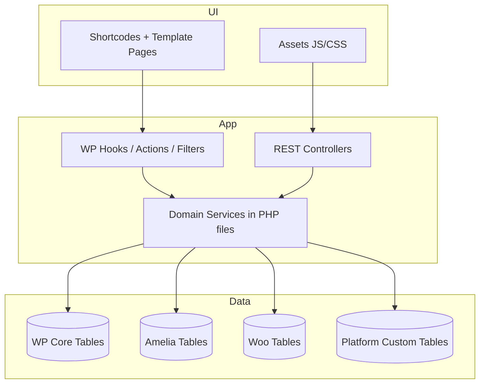
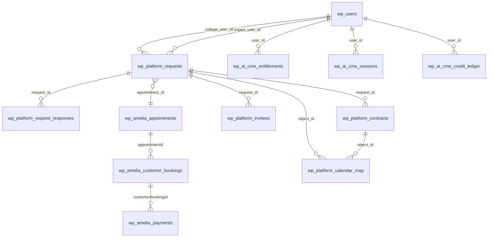
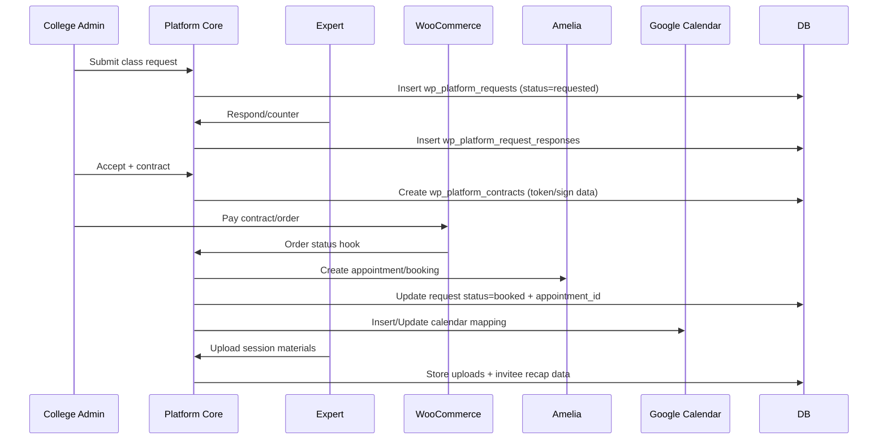

# SAPL Platform — Technical & Product Documentation

## 1) Product Overview

### What this system is
SAPL is a **WordPress-based EdTech/MedEd platform** that combines:
- **B2B live class booking** between colleges and experts.
- **B2C webinars** (free + paid) with materials and certificates.
- **Tutorial marketplace** and instructor operations.
- **AI‑CME module commerce + credit ledger**.
- **Support operations** (Fluent Support integration).

It is implemented as a WordPress site with heavy business logic in a custom plugin (`platform-core`) and must-use plugins for registration/role synchronization with Tutor LMS and Amelia Booking.

### Problem the system solves
The platform unifies fragmented workflows that typically require multiple SaaS tools:
- Instructor onboarding and role management.
- Scheduling and booking (Amelia).
- Payments/subscriptions (WooCommerce + Razorpay).
- Learning delivery (Tutor LMS).
- Post-session operations (contracts, materials, recap invites, certificates, invoicing, payouts).
- AI learning credit monetization and reconciliation.

### Core features
1. **Role-aware user journeys**: student, expert, college admin, publisher.
2. **College-to-expert request workflow** (request → response → contract → payment → booked session).
3. **Webinar workflow** (invite, scheduling, paid/free registration, booking reconciliation, materials, certificates).
4. **Expert dashboards** (sessions, webinars, transactions, invoices).
5. **College dashboards** (requests, contracts, shortlisted educators, recap invitees).
6. **AI-CME modules** as custom post type linked to Woo products + credit accounting.
7. **Automated Amelia mapping** for instructors/customers from Tutor events.
8. **Integrated support modal + ticket creation**.

### Target users / personas
- **College Admin**: requests expert-led classes, signs contracts, manages invitees, reviews sessions.
- **Medical Expert / Instructor**: receives invites/requests, sets availability, conducts webinars/classes, uploads materials, tracks revenue.
- **Student / Learner**: books webinars/tutorials, consumes materials, receives certificates, accesses AI-CME modules.
- **Publisher**: submits Tutor course monetization proposals for moderation.
- **Platform Admin**: controls settings, moderation, support, diagnostics, and payout processes.

### High-level user journey


---

## 2) System Architecture

### Overall architecture
The platform is a **modular monolith on WordPress**:
- Presentation: shortcode-rendered pages + custom CSS/JS.
- Domain/Application logic: `platform-core` plugin and MU plugins.
- Persistence: MySQL (WordPress core + plugin tables + custom platform tables).
- Integrations: Amelia API proxy, WooCommerce lifecycle hooks, Tutor LMS events, Google Calendar, Razorpay, Fluent Support.

### Architecture diagram


### Core components

| Layer | Component | Responsibility |
|---|---|---|
| CMS Core | WordPress | Routing, users, roles/capabilities, admin, options, hooks |
| Custom Business Plugin | `wp-content/plugins/platform-core` | Core product flows (college classes, webinars, AI-CME, dashboards, support) |
| MU Plugins | `inditech-college-admin-onboarding.php`, `tutor-custom-logic.php` | Registration-time role enforcement and Amelia synchronization |
| LMS | Tutor LMS + Tutor Pro | Course/instructor/student model and dashboard integration |
| Booking | Amelia Booking | Appointments/events/providers/customers and booking records |
| Commerce | WooCommerce (+ memberships/subscriptions + Razorpay) | Orders, checkout, payment lifecycle hooks |
| Support | Fluent Support (+ Pro) | Ticket inbox, saved replies, escalations |

### Application layers



### Services/modules map (custom)

| Module/File | Primary capability |
|---|---|
| `platform-core.php` | Bootstrap, roles, encryption, Google OAuth routes, CPTs, schema install, login redirects |
| `flow7-college.php` + `flow7-college-expert-ui.php` | Class request/response workflow |
| `sign-contract.php`, `contract-sessions.php`, `session-info.php` | Contract signing, contract/session views |
| `flow8-college-class.php` | Expert class operations + webhook for appointment updates |
| `flow9-college-recap.php` | Invitee bulk import, tokenized recap links, recap mail flow |
| `webinars.php`, `webinar-invites.php`, `webinar-info.php` | Webinar scheduling/invites/bookings/sync |
| `webinar-dashboard.php`, `webinar-library.php`, `webinar-expert-dashboard.php`, `webinar_payment.php`, `invoices.php` | Webinar discovery + expert finance dashboards |
| `paid-webinar-payment.php`, `free-webinar-payment.php` | Registration and payment branching for webinar events |
| `flow5-expert-tutorials.php`, `tutorials.php` | Tutorial lifecycle and payout backfill logic |
| `flow10-ai-cme-credits.php` + platform-core AI helpers | AI-CME credit/entitlement/session integration |
| `educator-profile.php`, `student-educator-profile.php`, `shortlisted-educators.php` | Educator discovery/profile/booking entrypoints |
| `support-modal.php`, `support-seeder.php` | Frontend support widget + Fluent Support seeded replies |
| MU: `tutor-custom-logic.php` | Tutor approval hooks + Amelia employee/customer creation queue |
| MU: `inditech-college-admin-onboarding.php` | College admin registration handling + Amelia customer linking |

### External integrations

| Integration | How used |
|---|---|
| Amelia API (`admin-ajax.php?action=wpamelia_api`) | Create/find customers/providers, create/update/cancel events, sync bookings |
| WooCommerce hooks | Order completion triggers entitlement grants and booking persistence |
| Razorpay | Payment gateway in Woo order flow (contract/webinar payments) |
| Google Calendar | Event insert/update/delete via stored OAuth tokens/options |
| Tutor LMS hooks | Instructor approval and student registration triggers mapping jobs |
| Fluent Support API/tables | Ticket escalation and pre-seeded canned responses |

---

## 3) Repository Structure

> The repository is a full WordPress runtime snapshot (application + plugin ecosystem + SQL exports).

```text
/
├── wp-config.php
├── sql/                              # Per-table SQL export files (schema + data)
├── wp-content/
│   ├── mu-plugins/
│   │   ├── inditech-college-admin-onboarding.php
│   │   └── tutor-custom-logic.php
│   ├── plugins/
│   │   ├── platform-core/            # Main custom platform plugin
│   │   ├── tutor/, tutor-pro/
│   │   ├── ameliabooking/
│   │   ├── woocommerce/, memberships, subscriptions, razorpay
│   │   └── fluent-support/, fluent-support-pro/
│   ├── themes/
│   │   ├── twentytwentyfour          # Active theme from options export
│   │   └── storefront                # Present, customized files also exist
│   └── uploads/                      # Runtime uploaded assets (contracts, materials, etc.)
└── meta.json
```

### Active plugin stack (from DB export)
Active plugins include WooCommerce, Tutor/Tutor Pro, Amelia Booking, Fluent Support, Razorpay connectors, and `platform-core`.

---

## 4) Runtime Configuration & Environment

### WordPress configuration highlights
- `WP_DEBUG` enabled with logging; display off.
- `WP_ENVIRONMENT_TYPE = staging`.
- Amelia constants configured directly in `wp-config.php` (API key, default location/service IDs/timezone).
- Additional admin debug notice for Fluent Support table checks exists in config file.

### Security observation (important)
The repository and SQL dump contain **plain-text secrets and staging credentials** patterns (API keys, OAuth identifiers, salts, etc.). Treat this repository as sensitive and rotate secrets before production use.

---

## 5) Data Model (Database)

## SQL extraction status
The requested DB dump appears already extracted into per-table files under `/sql`; no `full_dump.sql.zip` archive is present in the repository snapshot.

### Custom domain tables (core)

| Table | Purpose |
|---|---|
| `wp_platform_requests` | College class request header and lifecycle state |
| `wp_platform_request_responses` | Expert counter/responses to requests |
| `wp_platform_contracts` | Contract artifact/status/signing and pricing fields |
| `wp_platform_calendar_map` | Mapping between platform objects/bookings and Google Calendar IDs |
| `wp_platform_shortlists` | College-admin shortlisted experts |
| `wp_platform_invitees` | Invitee list/token/open tracking for recap access |
| `wp_platform_payouts` | Computed payout records for experts |
| `wp_webinar_materials` | Webinar documents/resources uploaded by experts |
| `wp_tutorial_uploads` | Tutorial/class file uploads |
| `wp_webinar_certificates` | Webinar completion certificates issuance log |
| `wp_ai_cme_entitlements` | Purchased access rights to AI-CME modules |
| `wp_ai_cme_credit_ledger` / `wp_ai_cme_credits_ledger` | Credit balance delta ledger |
| `wp_ai_cme_sessions` | AI-CME launch/return session tracking and payload audit |

### Row volume snapshot (from SQL inserts)

| Table | Approx rows in export |
|---|---:|
| `wp_platform_requests` | 124 |
| `wp_platform_request_responses` | 137 |
| `wp_platform_contracts` | 110 |
| `wp_platform_shortlists` | 10 |
| `wp_platform_payouts` | 18 |
| `wp_platform_invitees` | 1 |
| `wp_webinar_materials` | 9 |
| `wp_webinar_certificates` | 9 |
| `wp_tutorial_uploads` | 6 |
| `wp_ai_cme_credit_ledger` | 6 |
| `wp_ai_cme_sessions` | 1 |

### Key schema characteristics
- Most custom tables use **application-managed referential integrity** (indexes present; hard foreign keys generally absent).
- Status-driven workflows (`requested`, `pending_contract`, `booked`, etc.) are implemented in app logic.
- Tokenized signing/recap access stored as hashes + expiry dates.
- AI-CME tables include uniqueness for user-module entitlement and session IDs.

### Core relationship diagram


---

## 6) Roles, Capabilities, and Access Control

### Custom roles
- `student`
- `expert`
- `college_admin`
- `publisher`

Roles are created on plugin activation and re-checked on admin init. Multiple redirects and shortcode guards enforce role-segmented experiences.

### Access patterns
- Most dashboard shortcodes check `is_user_logged_in()` and role capabilities.
- REST endpoints use `permission_callback` with nonce/auth checks.
- Some endpoints are intentionally public for OAuth callback/return flows and apply nonce/secret verification in handler logic.

---

## 7) API Surface (Custom REST Endpoints)

Namespace: `platform-core/v1`

| Route | Methods | Purpose |
|---|---|---|
| `/google/oauth/start` | GET | Begin Google OAuth flow |
| `/google/oauth/callback` | GET | OAuth callback/token storage |
| `/contracts` | GET | College contract/session listing API |
| `/educator/slots` | GET | Fetch educator slot availability |
| `/educator/book` | POST | Create booking request from profile flow |
| `/college/response` | POST | Expert response to college request |
| `/college/contract/sign` | POST | Contract sign action |
| `/college/invitees/bulk` | POST | Bulk invitee ingestion |
| `/amelia/appointment-updated` | POST | Webhook to sync appointment changes |
| `/college/refresh-zoom` | POST | Refresh/fetch Zoom details |
| `/invites/{id}/accept` | POST | Accept webinar invite |
| `/invites/{id}/reject` | POST | Reject webinar invite |
| `/invites/{id}/reschedule` | POST | Reschedule webinar |
| `/invites/{id}/cancel` | POST | Cancel webinar |
| `/invites/{id}/attach-event` | POST | Attach existing Amelia event to invite |
| `/publish/course/{id}/pricing` | POST | Publisher pricing metadata save |
| `/support/ticket` | POST | Create support ticket |
| `/ai-cme/return` | POST/GET | AI-CME completion/credit return callback |

---

## 8) Major Business Flows

### 8.1 College class lifecycle (Flow 7/8/9)


### 8.2 Webinar lifecycle
- Expert receives/creates webinar invite.
- Accept action creates Amelia event + maps Woo product metadata (`_platform_amelia_event_id`, pattern free/paid).
- Student registers via free or paid registration page.
- Payment completion hooks create/confirm Amelia booking and payment rows.
- Materials uploaded to `wp_webinar_materials`; certificates recorded in `wp_webinar_certificates`.
- Booking expiry cron cancels stale unpaid reservations.

### 8.3 AI-CME credit lifecycle
```mermaid
flowchart LR
A[User buys module/credit pack] --> B[Woo order completed hook]
B --> C[Entitlement/Credit grant]
C --> D[Launch URL with signed JWT]
D --> E[External AI-CME session]
E --> F[/ai-cme/return callback]
F --> G[Session log + credit ledger write]
G --> H[Updated balance on dashboard]
```

### 8.4 Tutor ↔ Amelia synchronization lifecycle
- Instructor approval events trigger role enforcement (`expert` + `tutor_instructor`) and queued employee creation in Amelia.
- Student registration/role events trigger Amelia customer creation/linking.
- Retry queues and transient locks provide idempotence and duplicate suppression.

---

## 9) Shortcodes & User-Facing Pages

### Core shortcodes (selection)

| Shortcode | Intended page/purpose |
|---|---|
| `[platform_college_dashboard_ui]` | College admin dashboard |
| `[platform_college_request_class]`, `[platform_college_my_classes]` | College class request and list |
| `[platform_expert_college_requests]` | Expert inbox for class requests |
| `[platform_sign_contract]` | Contract signing page |
| `[platform_contract_sessions]` | Contract/sessions overview |
| `[platform_class_recap]` | Recap landing page with token |
| `[webinar_info]`, `[webinar_library]`, `[student_webinar_dashboard]` | Webinar browsing/details |
| `[webinar_expert_dashboard]`, `[webinar_payments]`, `[platform_expert_invoices]` | Expert webinar operations & finance |
| `[paid_webinar_registration]`, `[free_webinar_registration]` | Webinar registration flows |
| `[platform_educator_profile]`, `[student_educator_profile]` | Educator profile + booking entry |
| `[platform_shortlisted_educators]` | College shortlist management |
| `[platform_expert_hub]` | Expert tabbed workspace |
| `[platform_course_monetize]` | Publisher monetization form |
| `[ai_cme_cta]`, `[ai_cme_launch]`, `[ai_cme_credits_dashboard]` | AI-CME module actions/dashboard |
| `[student_dashboard]`, `[expert_dashboard]`, `[medical_expert_dashboard]` | Role dashboards |
| `[college_admin_register]`, `[role_selector]` | Onboarding/routing UX |

---

## 10) Commerce & Payments

### WooCommerce usage patterns
- Meta links between products/orders and Amelia objects:
  - `_platform_amelia_event_id`
  - `_platform_webinar_pattern` (`free` / `paid`)
  - `_platform_request_id` (contract/class flows)
  - `_amelia_booking_*` markers for idempotent booking creation.
- Direct order creation and redirect-to-payment pattern is used in some flows instead of cart-first checkout.
- Membership/subscription hooks are used for course and AI-CME access patterns.

### Payouts
- Payout rail computes gross/platform fee/net and stores per expert/month in `wp_platform_payouts`.
- Admin backfill tooling exists to recompute historical payout records.

---

## 11) Scheduling, Calendar, and Notifications

- Central calendar linkage persisted in `wp_platform_calendar_map`.
- Google Calendar operations: insert/update/delete based on booking/invite state transitions.
- Scheduled task (`wbex_cancel_expired_bookings`) runs every 15 minutes for unpaid booking expiry.
- Recap/invite emails and support messages route via configured mail stack.

---

## 12) Frontend/UX Implementation Notes

- Most pages are generated by shortcode with inline styles/scripts, often full-page takeover styles (hiding theme header/footer).
- Assets under `platform-core/assets` support expert hub, invite UIs, support modal, educator profile interactions.
- UX is role-focused, with heavy client-side filtering/tables in dashboards.

---

## 13) Operational Considerations

### Strengths
- Rich end-to-end business workflows implemented in one deployment unit.
- Deep integration with major WP ecosystem plugins (Amelia, Tutor, Woo).
- Practical idempotence mechanisms in critical sync/payment paths.

### Risks / technical debt
1. **Hard-coded secrets and API keys** in repository code/config.
2. **Mixed coding styles and duplicate helper definitions** across modules.
3. **Sparse hard DB constraints** means integrity depends on PHP logic.
4. **Large procedural files** may reduce testability/maintainability.
5. **Potential overlap between old/new flows** (e.g., legacy files, disabled sync file with early `return`).

### Recommended hardening roadmap
1. Move all secrets to environment variables/secret manager and rotate keys.
2. Consolidate Amelia/Google/Woo helpers into a single service layer.
3. Add DB foreign keys where safe, or enforce via migration scripts.
4. Add integration tests for booking/payment/idempotence critical paths.
5. Introduce observability standards (structured logs + correlation IDs).
6. Provide explicit API contracts (request/response schemas) for all REST routes.

---

## 14) Developer Runbook (Reconstruction Guide)

### Minimum platform dependencies
- WordPress + MySQL
- Active plugins:
  - platform-core
  - Tutor + Tutor Pro
  - Amelia Booking
  - WooCommerce (+ memberships, subscriptions)
  - Razorpay gateway plugins
  - Fluent Support (+ Pro)

### Bootstrapping from this repository
1. Provision WordPress runtime and MySQL.
2. Import SQL tables from `/sql` (or full database as needed).
3. Ensure `wp-content/plugins/platform-core` and MU plugins are present.
4. Configure environment-specific URLs and secrets in `wp-config.php` and options.
5. Validate role creation and run plugin activation hooks.
6. Verify Amelia/Woo/Tutor integration using test users for each role.

### Critical smoke test checklist
- College admin can create request and see it in dashboard.
- Expert can respond and contract can be signed.
- Payment completion creates expected booking and status transitions.
- Webinar free and paid registrations both complete end-to-end.
- AI-CME purchase grants entitlement and return callback updates credits.
- Support modal creates ticket.

---

## 15) Appendix A — Custom Tables Quick Reference

| Table | PK | Notable fields |
|---|---|---|
| `wp_platform_requests` | `id` | `college_user_id`, `expert_user_id`, `status`, `price_offer`, `appointment_id` |
| `wp_platform_request_responses` | `id` | `request_id`, `expert_user_id`, `response`, `price`, `proposed_start_iso` |
| `wp_platform_contracts` | `id` | `request_id`, `status`, `sign_token`, `signed_at`, `pdf_path`, `order_id` |
| `wp_platform_calendar_map` | `id` | `amelia_booking_id`, `source`, `object_id`, `google_event_id`, `zoom_url` |
| `wp_platform_invitees` | `id` | `request_id`, `email`, `token_hash`, `token_expires`, `open_count` |
| `wp_platform_payouts` | `id` | `expert_user_id`, `amount_gross`, `fee_platform`, `amount_net`, `month_key`, `status` |
| `wp_webinar_materials` | `id` | `event_id`, `material_type`, `file_url`, `uploaded_by` |
| `wp_webinar_certificates` | `id` | `certificate_id` (unique), `student_user_id`, `event_id`, `status` |
| `wp_ai_cme_entitlements` | `id` | unique (`user_id`,`module_id`), `source`, `expires_at`, `status` |
| `wp_ai_cme_credit_ledger` | `id` | `user_id`, `delta`, `old_balance`, `new_balance`, `reason` |
| `wp_ai_cme_sessions` | `id` | unique `session_id`, payload in/out, credits before/after/spent |

---

## 16) Appendix B — Architectural Summary

- **Style**: WordPress plugin-based modular monolith.
- **Domain center**: scheduling + commerce + learning + credentialing.
- **Persistence strategy**: hybrid of core WP tables, third-party plugin tables, and custom domain tables.
- **Integration strategy**: event/hook-driven orchestration with local DB as source of truth for platform-specific state.

This README is designed to be sufficient for onboarding a developer or AI agent to understand the product, architecture, flows, and data model without external context.
